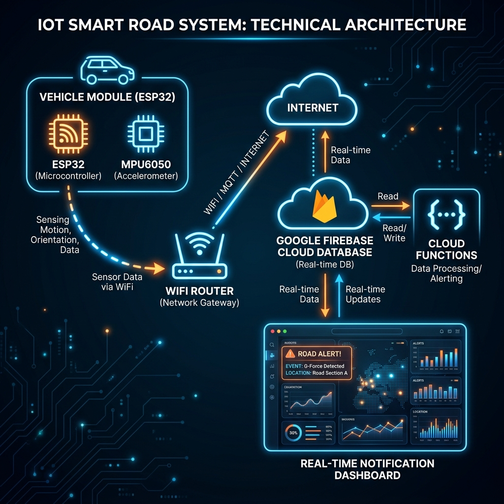
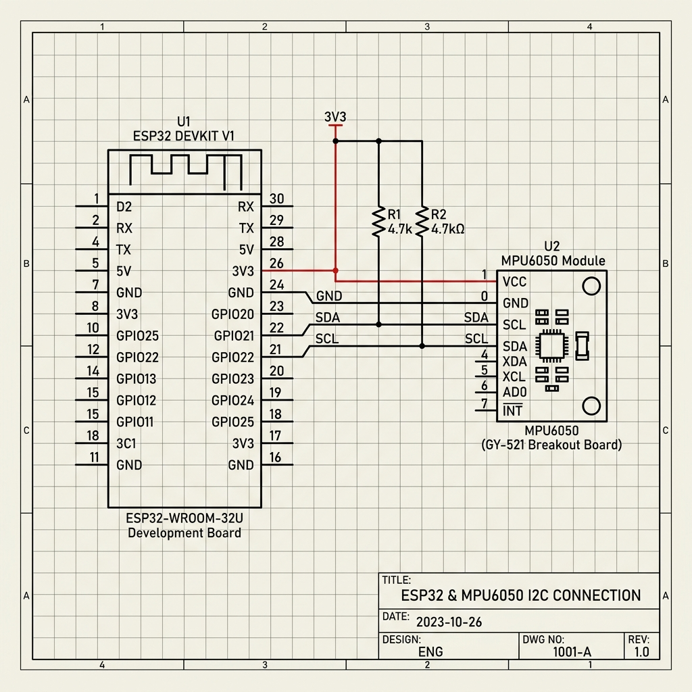
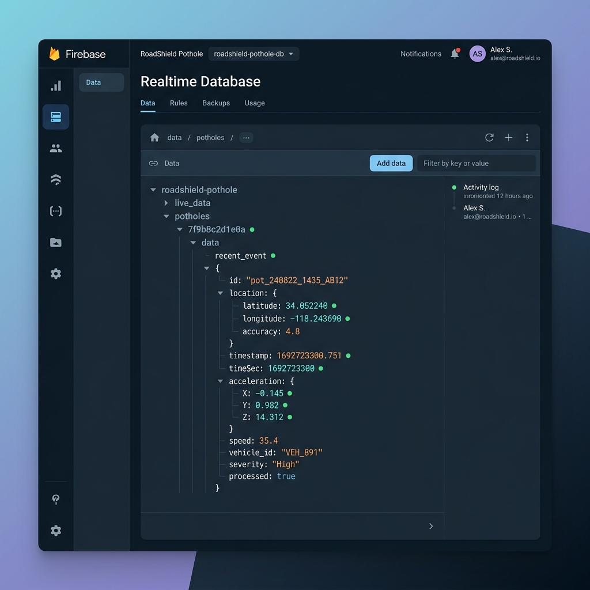
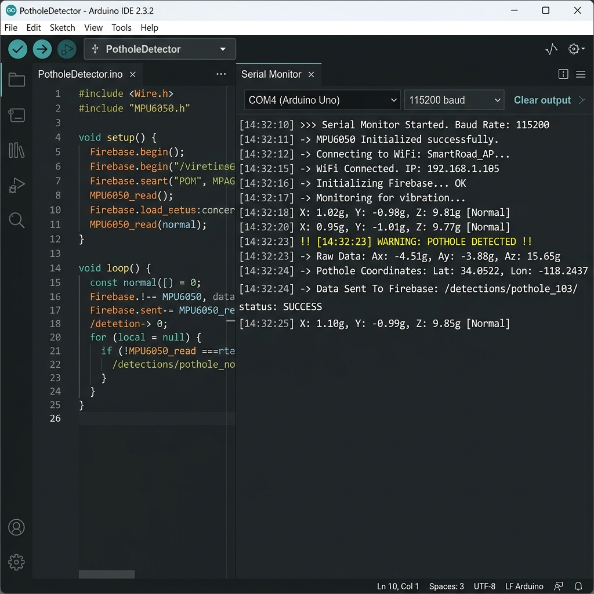
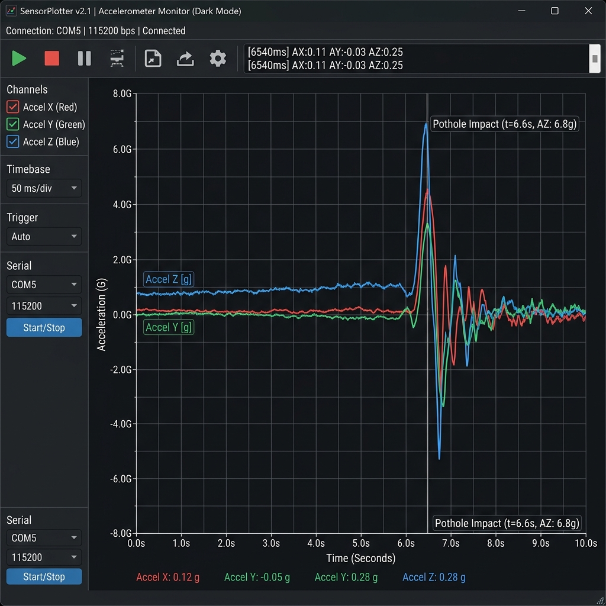
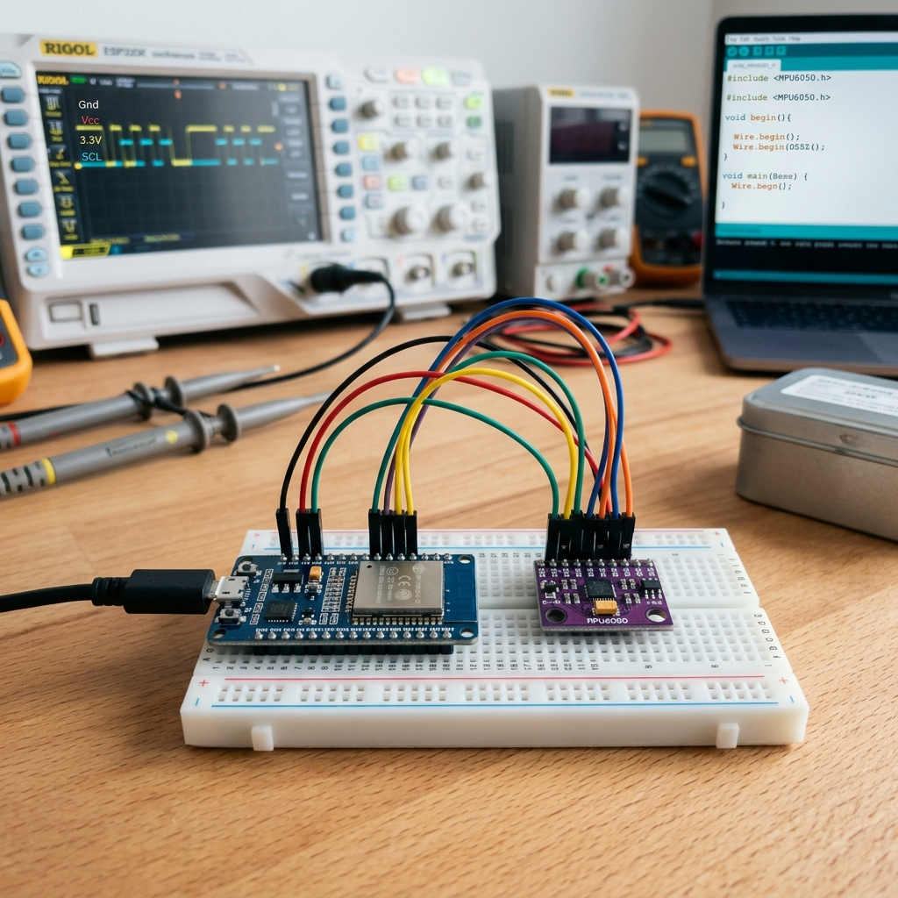
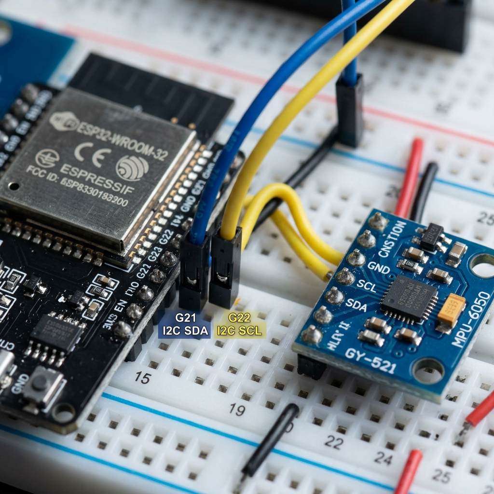

# 🛣️ ROAD SHIELD – Smart Pothole Detection System

<p align="center">
  
</p>

<p align="center">
  <strong>An Industry-Grade IoT & Embedded Telemetry Platform for Real-Time Road Surface Anomaly Monitoring</strong>
</p>

<p align="center">
  <!-- Badges -->
  <a href="https://github.com/therishikeshraj/pothole_detector/stargazers"></a>
  <a href="https://github.com/therishikeshraj/pothole_detector/network/members"></a>
  <a href="https://github.com/therishikeshraj/pothole_detector/issues"></a>
  <a href="https://github.com/therishikeshraj/pothole_detector/graphs/commit-activity"></a>
  <a href="LICENSE"></a>
</p>

<p align="center">
  
  
  
  
  
  
</p>

---

## 📌 Table of Contents

- [Overview](#-overview)
- [Problem Statement](#-problem-statement)
- [Key Features](#-key-features)
- [Hardware & Software Architecture](#-hardware--software-architecture)
- [System Working Principle](#-system-working-principle)
- [Circuit Connections](#-circuit-connections)
- [Firebase Realtime Database Schema](#-firebase-realtime-database-schema)
- [Repository Structure](#-repository-structure)
- [Installation & Quick Start](#-installation--quick-start)
- [Live Example Output](#-live-example-output)
- [Visual Media Gallery](#-visual-media-gallery)
- [Future Scope & Roadmap](#-future-scope--roadmap)
- [Repository Metadata & Topics](#-repository-metadata--topics)
- [Contributing & License](#-contributing--license)
- [Acknowledgements](#-acknowledgements)

---

## 🔍 Overview

**ROAD SHIELD** is an edge-computing Internet of Things (IoT) system engineered to detect potholes, bumps, and road anomalies in real time. Deployed on vehicle chassis or transit fleets, the embedded system samples 3-axis linear acceleration using an **MPU6050 MEMS sensor** controlled by an **ESP32 microcontroller**. 

When vertical impact forces violate calibrated safety bounds ($z > 15.0 \, m/s^2$ or $z < 5.0 \, m/s^2$), the system captures sensor telemetry, assigns geolocation coordinates, and streams the incident payload to **Firebase Realtime Database** via WiFi.

---

## ⚠️ Problem Statement

Potholes and deteriorated road surfaces cause thousands of vehicular accidents, structural damage, and transit delays globally every year. Conventional road inspection methods rely on manual physical surveys or expensive dedicated municipal vehicles, making defect mapping slow and irregular.

**ROAD SHIELD** solves this problem by offering an **automated, low-cost, real-time crowd-sourced telemetry node** that converts ordinary vehicles into smart road inspection agents.

---

## ✨ Key Features

- **⚡ Real-Time Anomaly Detection**: High-frequency sampling of 3-axis acceleration vectors ($X, Y, Z$) to identify sudden dips or structural bumps.
- **🔥 Firebase Cloud Telemetry**: Instant sync with Firebase Realtime Database using optimized lightweight Wi-Fi protocols.
- **📊 dual Console Outputs**: Built-in formatted CSV output for **Arduino Serial Plotter** (visualizing acceleration curves) and human-readable logs for **Serial Monitor**.
- **📍 Geolocation Payload Integration**: Telemetry structures pre-configured for GPS latitude/longitude indexing (ready for hardware expansion).
- **🛡️ Secure Configuration**: Zero hardcoded secrets; decoupled API keys and credentials.
- **⚙️ Industrial Modular Code**: Clean code design utilizing ESP-IDF logging control and wire error handling.

---

## 💻 Hardware & Software Architecture

### Hardware Components

| Component | Quantity | Description |
| :--- | :---: | :--- |
| **ESP32 Dev Module** | 1 | 32-bit Dual-Core Tensilica LX6 Microcontroller with Built-in WiFi & Bluetooth |
| **MPU6050 Module** | 1 | 6-Axis MotionTracking Device (3-Axis Accelerometer + 3-Axis Gyroscope) |
| **Solderless Breadboard** | 1 | High-density prototype board |
| **Jumper Wires** | 4 | Male-to-Female premium Dupont wires |
| **Micro-USB Cable** | 1 | Power supply (5V) & serial programming interface |

### Software Stack & Tools

- **Firmware Development**: Arduino IDE 2.x / ESP-IDF Core
- **Cloud Database**: Google Firebase Realtime Database (RTDB)
- **Protocols**: I2C ($0x68$ Slave Address), IEEE 802.11 b/g/n WiFi, HTTPS/REST
- **Telemetry Visualizer**: Arduino Serial Plotter / Firebase Web Console

---

## 🏗️ System Architecture

```text
+-------------------+      I2C Bus (SDA:21, SCL:22)      +-------------------+
|  MPU6050 Accelerometer  | ----------------------------------> |  ESP32 Microcontroller |
| (3-Axis Acceleration) |                                    | (Edge Detection Logic)|
+-------------------+                                    +-------------------+
                                                                   |
                                                             WiFi / HTTPS
                                                                   |
                                                                   v
+-------------------+       REST API Telemetry           +-------------------+
| Admin Dashboard / | <---------------------------------- | Firebase Realtime |
| Road Safety App   |                                    | Cloud Database    |
+-------------------+                                    +-------------------+
```

<p align="center">
  
</p>

---

## 🧠 System Working Principle

1. **Sensory Sampling**: The MPU6050 accelerometer measures linear acceleration across three perpendicular axes ($X, Y, Z$) at a scale of $\pm 2g$.
2. **Unit Conversion**: Raw 16-bit signed integers ($AcX, AcY, AcZ$) are scaled to $m/s^2$:
   $$\text{Acceleration } (m/s^2) = \left( \frac{\text{Raw Output}}{16384} \right) \times 9.81$$
3. **Threshold Condition**:
   Under flat, resting conditions, $Z \approx 9.81 \, m/s^2$ (Earth's gravity). A pothole impact triggers either:
   - **Vertical Drop / Free Fall**: $Z < 5.0 \, m/s^2$
   - **Severe Spike / Bump Impact**: $Z > 15.0 \, m/s^2$
4. **Cloud Transmission**: Upon threshold breach, an event snapshot containing $\{X, Y, Z, \text{Lat}, \text{Lng}, \text{Uptime}\}$ is dispatched to Firebase.

---

## 🔌 Circuit Connections

| ESP32 Dev Module | MPU6050 Pin | Signal Line | Operating Voltage |
| :--- | :--- | :--- | :--- |
| **3V3** | `VCC` | Power | 3.3V DC |
| **GND** | `GND` | Ground | 0V |
| **GPIO 21** | `SDA` | I2C Serial Data | 3.3V Logic |
| **GPIO 22** | `SCL` | I2C Serial Clock | 3.3V Logic |

> 📖 **Detailed Pinout Guide**: See [`circuit/pinout_guide.md`](circuit/pinout_guide.md) for full electrical documentation.

<p align="center">
  
</p>

---

## 🗄️ Firebase Realtime Database Schema

```json
{
  "RoadShield": {
    "Pothole": {
      "X": -1.24,
      "Y": 0.85,
      "Z": 16.78,
      "Latitude": 12.9716,
      "Longitude": 77.5946,
      "TimeSec": 142
    }
  }
}
```

<p align="center">
  
</p>

---

## 📂 Repository Structure

```text
pothole_detector/
├── README.md                 # Project Overview & System Documentation
├── LICENSE                   # MIT Open-Source License
├── .gitignore                # Git Ignore Patterns for Arduino & Secret files
├── libraries.txt             # Required Arduino Library Dependencies
├── main_code.ino             # Main ESP32 Firmware Sketch
├── CHANGELOG.md              # Project Version & Milestone History
│
├── docs/                     # Documentation Suite
│   ├── INSTALLATION.md       # Step-by-Step Installation Guide
│   ├── PROJECT_STRUCTURE.md  # Repository Taxonomy
│   ├── CONTRIBUTING.md       # Contribution Guidelines
│   ├── CODE_OF_CONDUCT.md    # Community Standards
│   └── SECURITY.md           # Security & Secret Management Policy
│
├── images/                   # High-Resolution Media & Visual Assets
│   ├── hardware_setup.png    # Hardware Breadboard Prototype
│   ├── esp32_mpu6050.png     # Module Wiring Close-Up
│   ├── serial_monitor.png    # Serial Console Output Log
│   ├── serial_plotter.png    # Accelerometer Waveform Plot
│   ├── firebase_dashboard.png# Firebase Realtime Database Preview
│   └── system_architecture.png# IoT System Architecture Infographic
│
└── circuit/                  # Hardware Wiring Schematics
    ├── circuit_diagram.png   # Full Wiring Blueprint
    └── pinout_guide.md       # Detailed Hardware Pinout Reference
```

---

## 🚀 Installation & Quick Start

1. **Clone Repository**:
   ```bash
   git clone https://github.com/therishikeshraj/pothole_detector.git
   cd pothole_detector
   ```
2. **Install Arduino IDE Libraries** (as listed in [`libraries.txt`](libraries.txt)):
   - `Firebase ESP Client` by Mobizt
3. **Configure Network & Database Credentials**:
   Open [`main_code.ino`](main_code.ino) and enter your credentials:
   ```cpp
   #define WIFI_SSID       "YOUR_WIFI_SSID"
   #define WIFI_PASSWORD   "YOUR_WIFI_PASSWORD"
   #define API_KEY         "YOUR_FIREBASE_API_KEY"
   #define DATABASE_URL    "YOUR_FIREBASE_DATABASE_URL"
   ```
4. **Flash to ESP32**: Select **ESP32 Dev Module**, choose COM Port, and press **Upload**.

> 📄 **Full Guide**: Refer to [`docs/INSTALLATION.md`](docs/INSTALLATION.md) for step-by-step instructions.

---

## 📺 Live Example Output

### Serial Monitor Console Log

```text
MPU6050 Initialized
Connecting WiFi.....
WiFi Connected
🌐 Device IP Address: 192.168.1.45
🔥 Firebase Realtime Database Ready

X: 0.12 | Y: -0.05 | Z: 9.78
X: 0.14 | Y: -0.02 | Z: 9.81

===========================================
⚠️ POTHOLE / ROAD ANOMALY DETECTED!
⏱️ Time Uptime (sec): 42
📍 Latitude         : 12.971600
📍 Longitude        : 77.594600
📊 Accel X (m/s²)   : -1.24
📊 Accel Y (m/s²)   : 0.85
📊 Accel Z (m/s²)   : 16.78
===========================================

✅ Telemetry Successfully Synced to Firebase RTDB
```

<p align="center">
  
  
</p>

---

## 🖼️ Visual Media Gallery

<p align="center">
  
  
</p>

---

## 🔮 Future Scope & Roadmap

- [ ] **GPS Module Integration**: Hardware pairing with NEO-6M / NEO-M8N for live dynamic NMEA GPS parsing.
- [ ] **Google Maps API Dashboard**: Interactive heatmaps plotting pothole coordinates for municipal road authorities.
- [ ] **Edge AI & Machine Learning**: Deploying **TensorFlow Lite for Microcontrollers (TFLite Micro)** to classify potholes vs. speed bumps using 3-axis vibration signatures.
- [ ] **Cross-Platform Mobile App**: Companion Flutter app providing audio alerts to drivers approaching mapped potholes.
- [ ] **Offline Telemetry Caching**: SPIFFS / LittleFS flash buffering during WiFi outages.
- [ ] **Over-The-Air (OTA) Updates**: Wireless firmware maintenance.
- [ ] **MQTT Protocol Support**: High-throughput broker integration for smart city traffic infrastructure.

---

## 🏷️ Repository Metadata & Recommended Topics

To maximize repository visibility for internships, portfolio showcases, and hackathons, set the following tags on GitHub:

```text
esp32  •  arduino  •  iot  •  firebase  •  embedded  •  mpu6050  •  road-safety  •  smart-city  •  smart-road  •  pothole-detection  •  wifi  •  microcontroller
```

### Suggested Repository Description (<350 characters):
> **ROAD SHIELD** is an IoT-based Smart Pothole Detection System powered by ESP32 and MPU6050 accelerometer sensor. Detects road surface anomalies in real time and uploads telemetry data to Firebase Realtime Database over WiFi.

---

## 🤝 Contributing & License

Contributions are welcome! Please read [`docs/CONTRIBUTING.md`](docs/CONTRIBUTING.md) and [`docs/CODE_OF_CONDUCT.md`](docs/CODE_OF_CONDUCT.md) before submitting Pull Requests.

Distributed under the **MIT License**. See [`LICENSE`](LICENSE) for details.

---

## 👏 Acknowledgements

- **Espressif Systems** for the ESP32 Arduino Core.
- **Mobizt** for the `Firebase ESP Client` library.
- **InvenSense** for MPU6050 sensor specifications.
